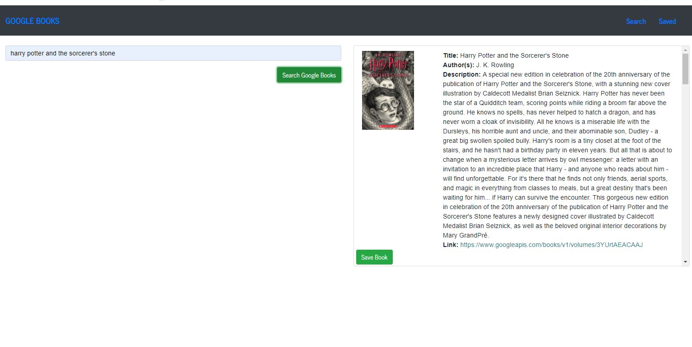

  
  # Google Books Assistant

  <h2>Description:</h2> a simple react app for searching google books and saving books to be able to view later. saved books can be deleted. 

  <h2>Table of Contents:</h2> 

  [Installation](#install)

  [Usage](#usage)

  [License](#license)

  [Contributing](#contributing)

  [Tests](#tests)

  [Questions](#questions)

  [Screenshots](#screenshots)

  <h3><a name="install">Installation:</a></h3>

  please run npm i to install necessary dependencies

  <h3><a name="usage">Usage:</a></h3>

  please use as you see fit deployed site available on heroku at: (https://warm-brook-79207.herokuapp.com/)

  <h3><a name="liscense">License:</a></h3>

  This work is covered under the CC0 1.0 Universal license.

  Full license information can be found here: [License: CC0-1.0](http://creativecommons.org/publicdomain/zero/1.0/)

  <h3><a name="contributing">Contributing:</a></h3> 

  feel free to fork me!

  <a name="tests"><h3>Tests:</h3></a> 

  no test procedures exist at this time

  <a name="questions"><h3>Questions:</h3></a>  

  gitHub Name: forgetfulmind

  gitHub Link: <a href="https://github.com/forgetfulmind">https://github.com/forgetfulmind</a>

  eMail: forgetfulmind@gmail.com

<a name="screenshots"><h3>Screenshots:</h3></a>  

